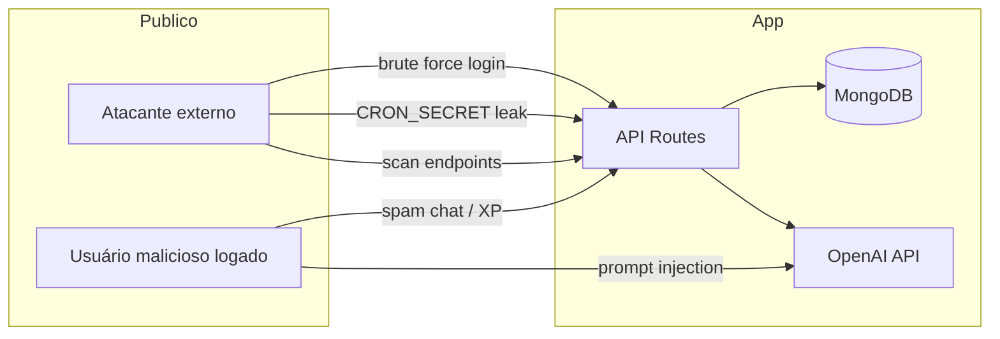

# Norte — Diagnóstico de Segurança

Auditoria do app em **20/06/2026**, com base no código em `src/`.  
Objetivo: mapear o que está exposto, dados sensíveis, riscos e prioridades de correção.

> **Nota:** Este documento descreve o estado atual do código. Não substitui pentest profissional ou revisão legal (LGPD).

---

## 1. Resumo executivo

| Nível | Quantidade | Significado |
|-------|------------|-------------|
| 🔴 **Crítico** | 2 | Corrigir antes de escalar usuários |
| 🟠 **Alto** | 5 | Corrigir nas próximas 1–2 semanas |
| 🟡 **Médio** | 6 | Planejar correção |
| 🟢 **Baixo / Info** | 8 | Melhorias e boas práticas |

### Veredicto geral

O app tem **base sólida** para um MVP: senhas com bcrypt, JWT em cookie `httpOnly`, APIs autenticadas por sessão, validação Zod na maioria dos inputs, sem `dangerouslySetInnerHTML`.

Os maiores riscos hoje são **abuse de APIs** (spam de XP, custo de IA), **fallback inseguro do JWT** se variável de ambiente faltar, e **falta de rate limiting / headers de segurança**.

---

## 2. Mapa de dados sensíveis

### 2.1 O que o app coleta e armazena

| Dado | Onde | Sensibilidade |
|------|------|---------------|
| **Email** | MongoDB `User` | PII — identificação |
| **Nome** | MongoDB `User` | PII |
| **Senha (hash bcrypt)** | MongoDB `User` | Crítico — nunca expor |
| **Objetivo / nível CEFR** | MongoDB `User` | Preferência — baixo |
| **Progresso (XP, streak, scores)** | MongoDB `User` | Comportamento — médio |
| **Preferências (idioma, push, timezone)** | MongoDB `User` | Baixo |
| **Mensagens de chat** | MongoDB `ChatMessage` | PII + conteúdo livre |
| **Respostas do assessment** | MongoDB `Assessment` | Comportamento |
| **Push subscription** (endpoint + keys) | MongoDB `User.pushSubscriptions` | Crítico — permite enviar push ao dispositivo |
| **JWT de sessão** | Cookie `ingles_session` | Crítico — acesso à conta |

### 2.2 O que fica só no servidor (nunca no browser)

| Secret | Arquivo / uso |
|--------|----------------|
| `MONGODB_URI` | `src/lib/db/mongodb.ts` |
| `JWT_SECRET` | `src/lib/auth/jwt.ts` |
| `VAPID_PRIVATE_KEY` | `src/lib/push/web-push.ts` |
| `CRON_SECRET` | `src/app/api/push/reminders/route.ts` |
| `AI_API_KEY` | `src/services/ai.service.ts` |

### 2.3 O que é exposto ao cliente (esperado)

| Variável `NEXT_PUBLIC_*` | Risco |
|--------------------------|-------|
| `NEXT_PUBLIC_APP_URL` | ✅ Público por design |
| `NEXT_PUBLIC_VAPID_PUBLIC_KEY` | ✅ Chave pública VAPID — normal |

### 2.4 O que o browser armazena (localStorage)

| Key | Conteúdo | Risco |
|-----|----------|-------|
| `norte_welcome_seen` | Flag UI | ✅ Não sensível |
| `norte_push_modal_seen` | Flag UI | ✅ Não sensível |
| `norte_push_card_dismissed_at` | Timestamp UI | ✅ Não sensível |

**Nenhum token ou senha no localStorage** — correto.

### 2.5 O que as APIs devolvem ao usuário logado

| Endpoint | Dados retornados | Problema? |
|----------|------------------|-----------|
| `GET /api/auth/me` | email, progress, preferences | ✅ Próprio usuário |
| `GET /api/profile` | email, progress, `hasPushSubscription` (boolean) | ✅ Não vaza push keys |
| `GET /api/chat` | Histórico de mensagens | ✅ Filtrado por `userId` |
| `POST /api/auth/login` | id, name, email (sem senha) | ✅ OK |

**Senha:** `select: false` no schema — não retorna em queries normais. ✅

---

## 3. Achados por severidade

### 🔴 CRÍTICO

#### C1 — Fallback fraco do `JWT_SECRET`

**Arquivo:** `src/lib/auth/jwt.ts:3-5`

```typescript
process.env.JWT_SECRET ?? "dev-secret-change-me"
```

Se `JWT_SECRET` não estiver definido na Vercel, **qualquer pessoa** que conheça o fallback pode forjar tokens e impersonar usuários.

**Correção:**
- Falhar o boot se `JWT_SECRET` ausente em produção
- Gerar secret forte: `openssl rand -base64 32`
- Nunca usar fallback em `NODE_ENV=production`

---

#### C2 — Endpoint de cron com bypass total via `?force=1`

**Arquivo:** `src/app/api/push/reminders/route.ts` + `src/lib/push/scheduler.ts`

Com `CRON_SECRET` válido, `?force=1` ignora slots, cap diário e cooldown — envia push a todos elegíveis.

Se o secret vazar (cron-job.org, logs, screenshot), atacante pode **spammar** todos os usuários.

**Correção:**
- Remover `force=1` em produção ou restringir a `NODE_ENV=development`
- Rotacionar `CRON_SECRET` periodicamente
- Usar IP allowlist no cron-job.org se disponível

---

### 🟠 ALTO

#### H1 — Sem rate limiting (login, register, chat, progress)

**Arquivos:** todas as rotas em `src/app/api/`

Riscos:
- **Brute force** em `/api/auth/login`
- **Abuse de custo** em `/api/chat` (cada POST = chamada OpenAI)
- **Spam de registro**
- **Farm de XP** em `/api/progress` e `/api/quiz/submit`

**Correção:**
- Rate limit por IP (Vercel Firewall, Upstash Redis, ou middleware)
- Sugestão: login 5/min, chat 20/hora, register 3/hora por IP

---

#### H2 — `/api/progress` POST sem validação — farm de XP

**Arquivo:** `src/app/api/progress/route.ts:12-13`

```typescript
const { type } = body as { type: "lesson" | "study" };
```

Qualquer valor incrementa XP/streak. Usuário autenticado pode scriptar milhares de requests.

**Correção:**
- Validar com Zod (`type: z.enum(["lesson", "study"])`)
- Idempotência por dia/lição
- Rate limit

---

#### H3 — Chat IA — abuso de custo e prompt injection

**Arquivo:** `src/services/ai.service.ts`, `src/app/api/chat/route.ts`

- Mensagem do usuário vai direto ao modelo sem sanitização
- **Prompt injection:** usuário pode tentar extrair system prompt ou instruções
- Sem limite de mensagens/dia = conta OpenAI explodir

**Correção:**
- Limite diário de mensagens (free tier)
- Delimitar input do usuário no prompt (`"""user message"""`)
- Monitorar custo OpenAI com alertas
- Não incluir dados sensíveis no system prompt

---

#### H4 — Enumeração de email no registro

**Arquivo:** `src/app/api/auth/register/route.ts:21`

Retorna `"Este email já está cadastrado"` (409) vs login genérico `"Email ou senha incorretos"`.

Atacante pode descobrir quais emails têm conta.

**Correção:**
- Mensagem genérica no registro: *"Se o email for válido, você receberá instruções"* (ou igual ao login)
- Ou aceitar o trade-off consciente no MVP

---

#### H5 — Middleware redireciona APIs não autenticadas (307 → `/`)

**Arquivo:** `src/middleware.ts:38-40`

APIs sem sessão recebem **redirect HTML** em vez de `401 JSON`. Comportamento inconsistente; ferramentas/crawlers podem se confundir.

Rotas como `/api/assessment/questions` dependem do middleware, não de check na rota.

**Correção:**
- Para paths `/api/*` sem sessão: `return NextResponse.json({ error: "Unauthorized" }, { status: 401 })`
- Adicionar auth explícita em rotas sensíveis

---

### 🟡 MÉDIO

#### M1 — Cookie sem `__Host-` prefix e `sameSite: lax`

**Arquivo:** login/register/logout routes

Atual: `httpOnly`, `secure` em prod, `sameSite: lax` — **aceitável**.

Melhorias:
- `sameSite: strict` para sessão (se não quebrar fluxo OAuth futuro)
- Considerar rotação de token / refresh token

---

#### M2 — JWT expira em 7 dias, sem revogação

**Arquivo:** `src/lib/auth/jwt.ts:7`

Cookie roubado = acesso por 7 dias. Logout limpa cookie no client, mas token ainda válido se copiado antes.

**Correção (futuro):** session store no Redis ou `tokenVersion` no User invalidado no logout.

---

#### M3 — Sem security headers

**Arquivo:** `next.config.ts` — vazio de headers

Faltam:
- `Content-Security-Policy`
- `X-Frame-Options` / `frame-ancestors`
- `X-Content-Type-Options: nosniff`
- `Referrer-Policy`
- `Permissions-Policy`

**Correção:** adicionar `headers()` no `next.config.ts`.

---

#### M4 — `/api/assessment/questions` sem auth na rota

**Arquivo:** `src/app/api/assessment/questions/route.ts`

Respostas corretas são removidas (`correctAnswer` stripped) — ✅ bom.

Mas a rota não verifica sessão internamente; depende 100% do middleware.

**Correção:** `getSession()` explícito na rota.

---

#### M5 — `/api/push/subscribe` GET público (via middleware bypass parcial)

**Arquivo:** `src/app/api/push/subscribe/route.ts:14-17`

Expõe `publicKey` VAPID — **esperado** (já é `NEXT_PUBLIC_*`). Risco baixo.

---

#### M6 — Logs de erro no servidor

**Arquivo:** `src/lib/api/response.ts:18`

`console.error("[API Error]", error)` — pode logar stack traces com detalhes internos na Vercel.

**Correção:** log estruturado sem vazar para cliente; cliente sempre recebe mensagem genérica (já faz ✅).

---

### 🟢 BAIXO / INFO

#### L1 — MongoDB via Mongoose

Queries parametrizadas — **baixo risco** de NoSQL injection se não usar `$where` raw com input do usuário. Estado atual: ✅ OK.

---

#### L2 — XSS no chat

Mensagens renderizadas com `{msg.content}` no React — **escapamento automático**. Sem `dangerouslySetInnerHTML`. ✅

---

#### L3 — `.env*` no `.gitignore`

Secrets locais não commitados por padrão. ✅  
Confirmar que `.env.local` nunca foi pushed no GitHub.

---

#### L4 — Senha: bcrypt cost 12 + regras Zod

**Arquivos:** `register/route.ts`, `validations/auth.ts`

Mínimo 8 chars, maiúscula, número — razoável para MVP.

Melhoria: verificar senhas vazadas (Have I Been Pwned API).

---

#### L5 — Autorização por usuário (IDOR)

Padrão consistente: `session.userId` em updates/queries. ✅  
Chat, profile, progress, assessment — todos scoped ao usuário logado.

**Nenhum IDOR óbvio encontrado.**

---

#### L6 — App layout ignora falha de DB

**Arquivo:** `src/app/(app)/layout.tsx:22-24`

Se MongoDB cair, usuário acessa app sem verificar onboarding — disponibilidade vs segurança. Baixo risco.

---

#### L7 — Dados em trânsito

Vercel fornece HTTPS. Cookies com `secure: true` em produção. ✅

---

#### L8 — LGPD (Brasil)

Você processa **dados pessoais** (email, nome, chat). Obrigações:

| Requisito | Status atual |
|-----------|--------------|
| Política de privacidade | ❌ Não implementada |
| Termos de uso | ❌ Não implementado |
| Base legal / consentimento | ❌ Falta na UI |
| Direito de exclusão de conta | ❌ Não há endpoint |
| Exportação de dados | ❌ Não há |
| DPO / contato | ❌ Falta |

**Prioridade legal** antes de marketing em escala.

---

## 4. Superfície de ataque (o que está exposto na internet)

```
Público (sem login)
├── /, /welcome, /install, /auth
├── POST /api/auth/login
├── POST /api/auth/register
├── POST /api/push/reminders  ← protegido por CRON_SECRET (Bearer)
└── GET  /api/push/subscribe   ← VAPID public key (middleware bloqueia sem cookie*)

Autenticado (cookie ingles_session)
├── Todas as rotas (app)/
├── GET/PATCH /api/profile
├── GET/POST /api/chat          ← $$$ custo IA
├── POST /api/progress          ← farm XP
├── POST /api/quiz/submit
├── GET/POST /api/assessment/*
└── POST/DELETE /api/push/subscribe

* Middleware redireciona; comportamento inconsistente
```

### Secrets que NÃO devem vazar

| Secret | Se vazar… |
|--------|-----------|
| `JWT_SECRET` | Forjar sessões de qualquer usuário |
| `MONGODB_URI` | Acesso total ao banco |
| `VAPID_PRIVATE_KEY` | Enviar push falsos |
| `CRON_SECRET` | Disparar lembretes / spam |
| `AI_API_KEY` | Uso da sua conta OpenAI |

---

## 5. O que já está bem feito ✅

1. **Senhas:** bcrypt (12 rounds), nunca retornadas na API  
2. **Sessão:** JWT em cookie `httpOnly` (não acessível via JS)  
3. **Validação:** Zod em auth, chat, assessment, profile, push  
4. **IDOR:** APIs usam `session.userId`, não ID da URL  
5. **Assessment:** respostas corretas removidas antes de enviar ao client  
6. **Push keys:** subscription completa só no DB; API expõe boolean  
7. **XSS:** React escapa conteúdo do chat  
8. **`.gitignore`:** arquivos `.env*` ignorados  
9. **Erros ao cliente:** mensagem genérica `"Erro interno do servidor"`  
10. **AI key:** só server-side  

---

## 6. Plano de ação prioritizado

### Semana 1 — Crítico + alto impacto

| # | Ação | Esforço |
|---|------|---------|
| 1 | Remover fallback `JWT_SECRET` em produção | 30 min |
| 2 | Confirmar todas env vars na Vercel (checklist abaixo) | 15 min |
| 3 | Rate limit login + register (Vercel ou Upstash) | 2–4 h |
| 4 | Rate limit + daily cap em `/api/chat` | 2–4 h |
| 5 | Validar body em `/api/progress` + rate limit | 1 h |
| 6 | Desabilitar `?force=1` em produção | 15 min |

### Semana 2 — Endurecimento

| # | Ação | Esforço |
|---|------|---------|
| 7 | Security headers no `next.config.ts` | 1 h |
| 8 | Middleware retorna 401 JSON para `/api/*` | 1 h |
| 9 | Auth explícita em todas as rotas API | 2 h |
| 10 | Política de privacidade + termos (página `/legal`) | 4 h |
| 11 | Endpoint `DELETE /api/account` (LGPD) | 3 h |

### Semana 3+ — Madurez

| # | Ação |
|---|------|
| 12 | Revogação de sessão no logout |
| 13 | Monitoramento (Sentry) + alertas custo OpenAI |
| 14 | Pentest externo ou OWASP ZAP scan |
| 15 | 2FA (opcional, pós-monetização) |

---

## 9. Checklist pré-lançamento

### Implementado no código ✅

```
[x] JWT_SECRET fail-fast em produção (sem fallback fraco)1
[x] ?force=1 desabilitado em produção (push cron)
[x] Rate limit: login (5/15min IP), register (3/h IP)
[x] Rate limit: chat (20/dia usuário), progress (10/h usuário)
[x] /api/progress validado com Zod
[x] Middleware: APIs sem sessão → 401 JSON
[x] Security headers (X-Frame-Options, nosniff, Referrer-Policy)
[x] /privacidade + /termos + checkbox no cadastro
[x] DELETE /api/account (LGPD — exclusão de conta)
[x] /api/assessment/questions exige autenticação
```

### Você ainda precisa configurar manualmente ⚠️

```
[ ] JWT_SECRET forte na Vercel (openssl rand -base64 32)
[ ] CRON_SECRET forte; URL do cron SEM ?force=1
[ ] MongoDB com senha + allowlist de IP
[ ] AI_API_KEY com spending limit na OpenAI
[ ] Confirmar .env.local nunca commitado no GitHub
[ ] Deploy desta versão na Vercel
```

**MongoDB Atlas:**
```
[ ] Network Access → allowlist (0.0.0.0/0 só se necessário; preferir Vercel IPs)
[ ] Usuário DB com permissão mínima (readWrite no db do app)
[ ] Backup automático ativado
[ ] MFA na conta Atlas
```

**GitHub:**
```
[ ] .env.local nunca commitado
[ ] Secrets scanning ativado
[ ] Branch protection em main
```

**cron-job.org:**
```
[ ] CRON_SECRET só no header Authorization
[ ] URL não compartilhada publicamente
[ ] Remover ?force=1 da URL de produção
```

---

## 8. Modelo de ameaça simplificado



---

## 9. Referências internas

- Push: [PUSH_NOTIFICATIONS.md](./PUSH_NOTIFICATIONS.md)
- PWA / install: [PWA_INSTALL.md](./PWA_INSTALL.md)
- Monetização: [MONETIZACAO_E_COMUNICACAO.md](./MONETIZACAO_E_COMUNICACAO.md)

---

## 10. Histórico de revisões

| Data | Versão | Notas |
|------|--------|-------|
| 2026-06-20 | 1.1 | Hardening pré-lançamento implementado (rate limit, LGPD, headers) |

---

*Próximo passo recomendado: corrigir **C1 (JWT fallback)** e **H1 (rate limiting)** antes de divulgar o app publicamente.*
